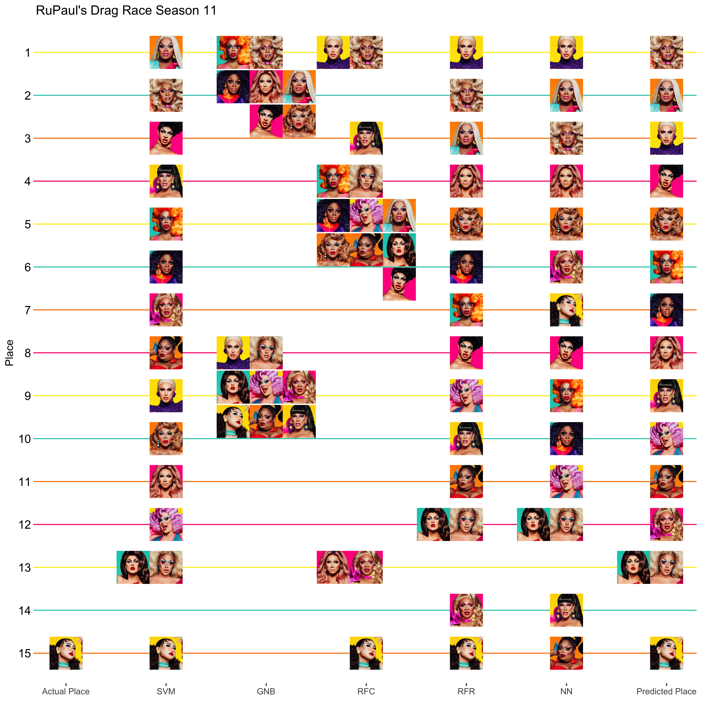

Drag Race Season 11 Episode 1
================
Thomas Elliott
March 1, 2019

Beginning with season 8 of RuPaul's Drag Race, I began using machine learning algorithms to try to predict the outcome of the season. I wrote the script in Python, and for the past three seasons I've run the script to try to predict the outcomes of each season. Season 11 of Drag Race begins in March, 2018, and for this season I decided to transition to using R for my predictions. In recent years, packages supporting machine learning in R has proliferated, and since I use R in my day job, I wanted to use it for this project as well.

For those not familiar with Rupaul’s Drag Race, it is a reality competition show, similar to America’s Next Top Model or Project Runway, in which 9-15 (it varies each season) drag queens must succeed at weekly challenges that test their Charisma, Uniqueness, Nerve, and Talent to become America’s Next Drag Superstar. In recent seasons, this has come with a cash prize of 100K dollars, along with various other perks. The weekly challenges take various forms, but usually include sewing challenges, in which queens must make themed garments out of unusual materials, acting challenges, in which queens act out humorous (and often irreverent) scenes, and every season since season 2 has included the Snatch Game, a parody of the 1970s TV game show Match Game in which queens must dress up and perform celebrity impressions as panelists on the Snatch Game, with guest judges for the week serving as contestents. The end of every episode, regardless of challenge, begins with a runway walk in which the queens must walk the runway in a themed look and then the queens are critiqued by the judges for their performance in the challenge as well as their runway look. The two worst performing queens for the week must then lipsync for their life, and whoever impresses Rupaul the most with their lipsync gets to stay, and the other queen must sashay away.

For those not familiar with machine learning, it is a family (or, really families) of algorithms for exploring and predicting data. There are two broad groups of families: supervised and unsupervised. Unsupervised learning algorithms are used when you have data you would like to classify without knowing what the right answers are before hand. Principal components analysis and K-means clustering are examples of unsupervised learning algorithms. Supervised algorithms are used when you already know the answer for at least some of your data. These algorithms work by feeding in a set of features (independent variables) and the labels, or answers, and the algorithm works to figure out how to get from the features to the labels. One of the biggest differences between standard statistical analysis and machine learning is that in standard statistical analysis, the model is the most important part of the process – understanding how it gets from the independent variables to the predicted dependent variable, and the relationship between these variables. In machine learning, the model is usually not important at all, and is treated as a black box. Instead, machine learning focuses on how well the model predicts the labels.

``` r
all.seasons<-data.df %>% 
  replace_na(list(Wins=0, Highs=0, Lows=0, Lipsyncs=0))
train.df<-all.seasons %>% 
  filter(Season<9)
train.df.factor<-train.df %>% 
  mutate(Place=factor(Place))
test.df<-all.seasons %>% 
  filter(Season==10) %>% 
  select(Name,Place,Season,Age,Black,White,POC,PlusSize,Wins,Highs,Lows,Lipsyncs)
pre11<-all.seasons %>% 
  filter(Season<11)
pre11.factor<-pre11 %>% 
  mutate(Place=factor(Place))
season11<-all.seasons %>% 
  filter(Season==11)
s11.results<-season11 %>% 
  select(Name,filename,Place)
season11<-season11 %>% 
  select(Name,Place,Season,Age,Black,White,POC,PlusSize,Wins,Highs,Lows,Lipsyncs)

the.model<-Place ~ Season + Age + Black + White + POC + PlusSize + Wins + Highs + Lows + Lipsyncs
```

Meet the Queens
===============

Let’s begin the challenge by meeting our contestants. First up is **Support Vector Machines**, a classifier with a pretty intuitive algorithm. Imagine you plot points on a two-dimensional graph. Support vector machines (SVM) attempts to separate out the groups defined by the labels using a line or curve that maximizes the distance between the dividing line and the closest points. If you have more than two features (as is often the case), the same thing happens but in a higher dimensional space.

The next to enter the work room is **Gaussian Naive Bayes**, an algorithm that is not as intuitive as SVM, but faster and simpler to implement. Gaussian naive Bayes algorithms assume that the data for each label is generated from a simple gaussian (or normal) distribution. Using Bayes theorem, along with some simplifying assumptions (which makes it naive), this algorithm uses the features and labels to estimate the gaussian distributions which it uses to make its predictions.

Our third contestant is the **Random Forest Classifier**. Random forests are aggregations of decision trees (get it!?). Decision trees are classifying algorithms composed of a series of decision points, splitting the data at each decision point to try to properly classify the data. Think of a game of Guess Who or Twenty Questions – you ask a series of yes/no questions to try to sort possibilities into different bins. Decision trees work the same way, with any number of possible bins. The problem with decision trees is that they tend to overthink the data, meaning that they do a really good job of predicting the training data, but the decision points are specific to the training data and so they aren’t so good at predicting testing data. The solution is to split the training data itself into different subsets, create decision trees for each subset, and then average those trees together to create a “forest” that typically does a much better with testing data than a single tree.

The fourth contestant is the **Random Forest Regressor**, also from the Haus of Random Forests, it works much the same way the classifier does, but rather than trying to predict unordered categories, it is predicting continuous values.

Our final contestant is **Neural Network**. Neural networks are a family of methods that roughly simulate connections between neurons in a biological brain. The neural network used here consists of neurons that take some number of values as inputs, applies weights to these values (that can be adjusted in the learning process), then applies these values to a logistic function to produce an output between 0 and 1. Neural networks consist of two or more layers of neurons (an input layer, an output layer, and zero or more hidden layers). The neural network I use here has one hidden layer consisting of three neurons.

The Maxi Challenge: Predicting Season 11
========================================

The main challenge is to predict the outcome of season 11 of RuPaul's drag race. To do so, we'll use the following features in our models:

1.  Season the queen appeared in
2.  Age of the queen
3.  Whether the queen is Black
4.  Whether the queen is white
5.  Whether the queen is a non-Black person of color
6.  Whether the queen is Plus Size
7.  The total number of main challenges a queen won during the season
8.  The total number of times a queen was among the top queens for the challenge, but did not win the challenge
9.  The total number of times a queen was among the worst queens for the challenge, but did not lip-sync
10. The total number of times a queen had to lip-sync for her life (including the lip-sync that she sashayed away from)

For all four algorithms, I rank the predicted ranks, as some algorithms did not predict any queens to place first. Ranking the predicted ranks ensures that at least one queen will be predicted to come in first.

Support Vector Machines
-----------------------

``` r
s11.svm<-ksvm(the.model,
              data=pre11,
              kernal="rbfdot")
predict11<-predict(s11.svm,
                   season11)
s11.results<-s11.results %>% 
  mutate(SVM=rank(predict11,ties.method = "min"))
```

Gaussian Naive Bayes
--------------------

``` r
s11.gnb<-naiveBayes(the.model,
              data=pre11.factor,
              laplace = 0)
predict11<-predict(s11.gnb,
                   season11)
```

    ## Warning in data.matrix(newdata): NAs introduced by coercion

``` r
s11.results<-s11.results %>% 
  mutate(GNB=rank(predict11,ties.method = "min"))
```

Random Forest Classifier
------------------------

``` r
s11.rfc<-randomForest(the.model,
              data=pre11.factor,
              ntree=100)
predict11<-predict(s11.rfc,
                   season11)
s11.results<-s11.results %>% 
  mutate(RFC=rank(predict11,ties.method = "min"))
```

Random Forest Regressor
-----------------------

``` r
s11.rfr<-randomForest(the.model,
              data=pre11,
              ntree=100)
predict11<-predict(s11.rfr,
                   season11)
s11.results<-s11.results %>% 
  mutate(RFR=rank(predict11,ties.method = "min"))
```

Neural Networks
---------------

``` r
s11.nn<-neuralnet(the.model,
              data=pre11,
              hidden=3,
              act.fct = "logistic",
              algorithm = "rprop+")
predict11<-predict(s11.nn,
                   season11)
s11.results<-s11.results %>% 
  mutate(NN=rank(predict11,ties.method = "min"))
```

Final Predictions
-----------------

The final predicted score is based on the average of predicted places for each algorithm.

With one episode down, the algorithms are predicting our top 4 to be A'Keria, Mercedes, Brooke Lynn, and Honey. The algorithms correctly guessed that Soju would be going home first, and predict that next week Nina West will be sashaying away.

``` r
s11.results<-s11.results %>% 
  mutate(Average=(SVM+GNB+RFC+RFR+NN)/5,
         `Predicted Rank`=rank(Average, ties.method = "min"))
s11.results %>% 
  arrange(Average) %>% 
  select(-filename) %>% 
  knitr::kable()
```

| Name                     |  Place|  SVM|  GNB|  RFC|  RFR|   NN|  Average|  Predicted Rank|
|:-------------------------|------:|----:|----:|----:|----:|----:|--------:|---------------:|
| A'keria Chanel Davenport |     NA|    2|    1|    1|    2|    3|      1.8|               1|
| Mercedes Iman Diamond    |     NA|    1|    1|    4|    3|    2|      2.2|               2|
| Brooke Lynn Hytes        |     NA|    9|    8|    1|    1|    1|      4.0|               3|
| Yvie Oddly               |     NA|    3|    1|    4|    8|    8|      4.8|               4|
| Vanessa Vanjie Mateo     |     NA|   10|    1|    4|    5|    5|      5.0|               5|
| Honey Davenport          |     NA|    5|    1|    4|    7|    9|      5.2|               6|
| Ra'jah O'Hara            |     NA|    6|    1|    4|    6|   10|      5.4|               7|
| Plastique Tiara          |     NA|   11|    1|   13|    4|    4|      6.6|               8|
| Shuga Cain               |     NA|    4|    8|    3|   10|   14|      7.8|               9|
| Nina West                |     NA|   12|    8|    4|    9|   11|      8.8|              10|
| Silky Nutmeg Ganache     |     NA|    8|    8|    4|   11|   15|      9.2|              11|
| Kahanna Montrese         |     NA|    7|    8|   13|   14|    6|      9.6|              12|
| Ariel Versace            |     NA|   13|    8|    4|   12|   12|      9.8|              13|
| Scarlet Envy             |     NA|   13|    8|    4|   12|   12|      9.8|              13|
| Soju                     |     15|   15|    8|   15|   15|    7|     12.0|              15|

``` r
df<-s11.results %>% 
  mutate(filename=paste0("../queens/",filename,".jpg")) %>% 
  gather(model,rank,Place:`Predicted Rank`) %>% 
  filter(model!="Average") %>% 
  mutate(model=factor(model, levels = c("Place", "SVM", "GNB", "RFC", "RFR", "NN", "Predicted Rank")),
         x=as.numeric(model),
         y=16-rank)
labels<-df %>% 
  filter(model=="Predicted Rank") %>% 
  mutate(x=8)
for(i in unique(df$model) ) {
  places<-list()
  for( n in unique(df$Name) ) {
    temp<-df %>% filter(Name==n&model==i)
    this.rank<-as.character(temp$rank)
    if( !is.na(this.rank) ) {
      if( this.rank %in% names(places) ) {
        places[[this.rank]]<-places[[this.rank]]+1
      } else {
        places[[this.rank]]<-1
      }
      new.xy<-setXY(temp$x,temp$y,places[[this.rank]])
      df$x[df$Name==n&df$model==i]<-new.xy[1]
      df$y[df$Name==n&df$model==i]<-new.xy[2]
    }
  }
}
df %>% 
  ggplot(aes(x=x, y=y)) +
  geom_image(aes(image=filename)) +
  theme_bw() +
  scale_x_continuous(name=NULL, breaks=c(1:7), 
                     labels=c("Actual Place", "SVM", "GNB", "RFC", "RFR", "NN", "Predicted Place")) +
  scale_y_continuous(name="Place", breaks=c(1:15), labels=c(15:1)) +
  labs(title="RuPaul's Drag Race Season 11")
```



``` r
ggsave("season11_results.png", width=10, height=10, dpi=400)
```
