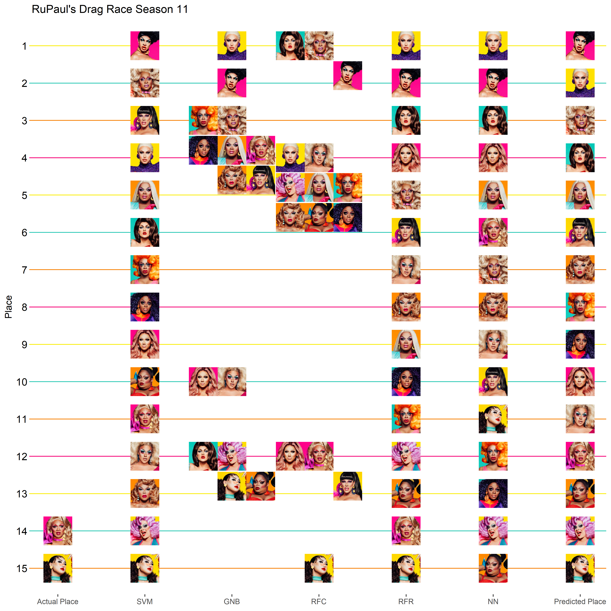

Drag Race Season 11 Episode 2
================
Thomas Elliott
March 10, 2019

Episode 2: Good God Girl this challenge was rough.
==================================================

[Last week](../Episode%20/drag_race_s11e01.md) I re-introduced my machine learning algorithms for predicting the outcomes of Season 11 of RuPaul's Drag Race.

This week, the queens were split into two groups and asked to perform in parody versions of Black Panther and Get Out. Shuga Cain, Plastique Tiara, Scarlet Envy, and Yvie Oddly were praised for their performances, and Scarlet and Yvie were declared dual winners of the challenge. Brooke Lynn Heights, Ariel Versace, Mercedes Iman Diamond, and Kahanna Montrese fell in the bottom for not delivering on their performances, and Mercedes and Kahanna had to lip sync for their lives. Ultimately, Mercedes won the lip sync, and Kahanna was asked to sashay away.

Incorporating this week's performances into the data, the algorithms have new predictions for the season:

Support Vector Machines
-----------------------

``` r
s11.svm<-ksvm(the.model,
              data=pre11,
              kernal="rbfdot")
predict11<-predict(s11.svm,
                   season11)
s11.results<-s11.results %>% 
  mutate(SVM=rank(predict11,ties.method = "min"))
```

Gaussian Naive Bayes
--------------------

``` r
s11.gnb<-naiveBayes(the.model,
              data=pre11.factor,
              laplace = 0)
predict11<-predict(s11.gnb,
                   season11)
```

    ## Warning in data.matrix(newdata): NAs introduced by coercion

``` r
s11.results<-s11.results %>% 
  mutate(GNB=rank(predict11,ties.method = "min"))
```

Random Forest Classifier
------------------------

``` r
s11.rfc<-randomForest(the.model,
              data=pre11.factor,
              ntree=100)
predict11<-predict(s11.rfc,
                   season11)
s11.results<-s11.results %>% 
  mutate(RFC=rank(predict11,ties.method = "min"))
```

Random Forest Regressor
-----------------------

``` r
s11.rfr<-randomForest(the.model,
              data=pre11,
              ntree=100)
predict11<-predict(s11.rfr,
                   season11)
s11.results<-s11.results %>% 
  mutate(RFR=rank(predict11,ties.method = "min"))
```

Neural Networks
---------------

``` r
s11.nn<-neuralnet(the.model,
              data=pre11,
              hidden=3,
              act.fct = "logistic",
              algorithm = "rprop+")
predict11<-predict(s11.nn,
                   season11)
s11.results<-s11.results %>% 
  mutate(NN=rank(predict11,ties.method = "min"))
```

Final Predictions
-----------------

The final predicted score is based on the average of predicted places for each algorithm.

Yvie moves from fourth to first with her win, and Scarlet makes an even bigger jump from a predicted 13th place last week to fourth this week. Brooke Lynn and A'Keria remain in the top four, while Mercedes drops to fifth for having to lip sync this week.

Last week, the algorithms predicted a double elimination of Scarlet Envy and Ariel Versace. Scarlet surprised us with a win however, though Ariel was in the bottom four this week. Now, though, the algorithms are predicting Nina West going home next. She was in the bottom last week, and basically forgettable this week. She's a seasoned queen, though, so she might be able to surprise us next week when the queens will perform in live Diva worship talk shows.

``` r
s11.results<-s11.results %>% 
  mutate(Average=(SVM+GNB+RFC+RFR+NN)/5,
         `Predicted Rank`=rank(Average, ties.method = "min"))
s11.results %>% 
  arrange(Average) %>% 
  select(-filename) %>% 
  knitr::kable()
```

| Name                     |  Place|  SVM|  GNB|  RFC|  RFR|   NN|  Average|  Predicted Rank|
|:-------------------------|------:|----:|----:|----:|----:|----:|--------:|---------------:|
| Yvie Oddly               |     NA|    1|    2|    1|    2|    2|      1.6|               1|
| Brooke Lynn Hytes        |     NA|    4|    1|    4|    1|    1|      2.2|               2|
| A'keria Chanel Davenport |     NA|    2|    3|    1|    5|    7|      3.6|               3|
| Scarlet Envy             |     NA|    6|   12|    1|    3|    3|      5.0|               4|
| Mercedes Iman Diamond    |     NA|    5|    3|    4|    9|    5|      5.2|               5|
| Shuga Cain               |     NA|    3|    3|   12|    6|   10|      6.8|               6|
| Vanessa Vanjie Mateo     |     NA|   13|    3|    4|    8|    8|      7.2|               7|
| Honey Davenport          |     NA|    7|    3|    4|   11|   12|      7.4|               8|
| Ra'jah O'Hara            |     NA|    8|    3|    4|   10|   13|      7.6|               9|
| Plastique Tiara          |     NA|    9|   10|   12|    4|    4|      7.8|              10|
| Ariel Versace            |     NA|   12|   10|    4|    7|    9|      8.4|              11|
| Kahanna Montrese         |     14|   11|    3|   12|   14|    6|      9.2|              12|
| Silky Nutmeg Ganache     |     NA|   10|   12|    4|   13|   15|     10.8|              13|
| Nina West                |     NA|   14|   12|    4|   12|   14|     11.2|              14|
| Soju                     |     15|   15|   12|   15|   15|   11|     13.6|              15|

``` r
df<-s11.results %>% 
  mutate(filename=paste0("../queens/",filename,".jpg")) %>% 
  gather(model,rank,Place:`Predicted Rank`) %>% 
  filter(model!="Average") %>% 
  mutate(model=factor(model, levels = c("Place", "SVM", "GNB", "RFC", "RFR", "NN", "Predicted Rank")),
         x=as.numeric(model),
         y=16-rank)
labels<-df %>% 
  filter(model=="Predicted Rank") %>% 
  mutate(x=8)
for(i in unique(df$model) ) {
  places<-list()
  for( n in unique(df$Name) ) {
    temp<-df %>% filter(Name==n&model==i)
    this.rank<-as.character(temp$rank)
    if( !is.na(this.rank) ) {
      if( this.rank %in% names(places) ) {
        places[[this.rank]]<-places[[this.rank]]+1
      } else {
        places[[this.rank]]<-1
      }
      new.xy<-setXY(temp$x,temp$y,places[[this.rank]])
      df$x[df$Name==n&df$model==i]<-new.xy[1]
      df$y[df$Name==n&df$model==i]<-new.xy[2]
    }
  }
}
df %>% 
  ggplot(aes(x=x, y=y)) +
  geom_image(aes(image=filename)) +
  theme_bw() +
  theme(panel.grid.major.x = element_blank(),
        panel.grid.minor = element_blank(),
        panel.border = element_blank(),
        panel.grid.major.y = element_line(color=season.colors),
        axis.text.y = element_text(color="black", size=12),
        axis.ticks.y = element_line(color=season.colors)) +
  scale_x_continuous(name=NULL, breaks=c(1:7), 
                     labels=c("Actual Place", "SVM", "GNB", "RFC", "RFR", "NN", "Predicted Place")) +
  scale_y_continuous(name="Place", breaks=c(1:15), labels=c(15:1)) +
  labs(title="RuPaul's Drag Race Season 11")
```



``` r
ggsave("season11_results.png", width=10, height=10, dpi=400)
```
