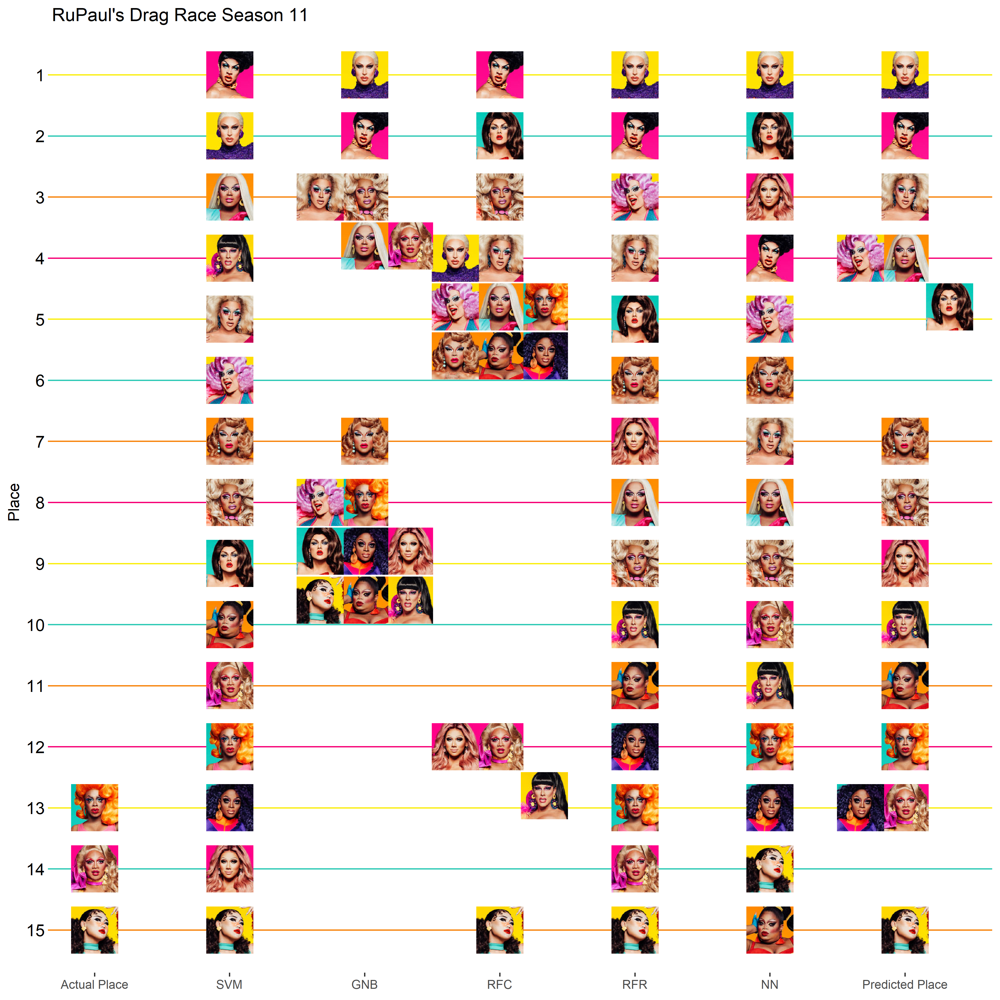

Drag Race Season 11 Episode 3
================
Thomas Elliott
March 19, 2019

Episode 3: Diva Worship
=======================

[This season](../Episode%20/drag_race_s11e01.md) I re-introduced my machine learning algorithms for predicting the outcomes of Season 11 of RuPaul's Drag Race.

This week, the queens were split into groups again, this time to perform in live, improve parodies of televangelist shows. Each group had to choose a Diva to worship during the shows. One group chose Britney Spears, and did an excellent job. The other group chose Mariah, and did an all around terrible job. The group didn't know much about Mariah, and so floundered through their performance. As a result, all six members of the group had to lip-sync for their lives. Ultimately, Honey Davenport had to sashay away while everyone else got to stay.

Incorporating this week's performances into the data, the algorithms have new predictions for the season:

Support Vector Machines
-----------------------

``` r
s11.svm<-ksvm(the.model,
              data=pre11,
              kernal="rbfdot")
predict11<-predict(s11.svm,
                   season11)
s11.results<-s11.results %>% 
  mutate(SVM=rank(predict11,ties.method = "min"))
```

Gaussian Naive Bayes
--------------------

``` r
s11.gnb<-naiveBayes(the.model,
              data=pre11.factor,
              laplace = 0)
predict11<-predict(s11.gnb,
                   season11)
```

    ## Warning in data.matrix(newdata): NAs introduced by coercion

``` r
s11.results<-s11.results %>% 
  mutate(GNB=rank(predict11,ties.method = "min"))
```

Random Forest Classifier
------------------------

``` r
s11.rfc<-randomForest(the.model,
              data=pre11.factor,
              ntree=100)
predict11<-predict(s11.rfc,
                   season11)
s11.results<-s11.results %>% 
  mutate(RFC=rank(predict11,ties.method = "min"))
```

Random Forest Regressor
-----------------------

``` r
s11.rfr<-randomForest(the.model,
              data=pre11,
              ntree=100)
predict11<-predict(s11.rfr,
                   season11)
s11.results<-s11.results %>% 
  mutate(RFR=rank(predict11,ties.method = "min"))
```

Neural Networks
---------------

``` r
s11.nn<-neuralnet(the.model,
              data=pre11,
              hidden=3,
              act.fct = "logistic",
              algorithm = "rprop+")
predict11<-predict(s11.nn,
                   season11)
s11.results<-s11.results %>% 
  mutate(NN=rank(predict11,ties.method = "min"))
```

Final Predictions
-----------------

The final predicted score is based on the average of predicted places for each algorithm.

This week, Brooke Lynn Hytes moved into the top spot. Yvie Oddly remains in the top four, while Ariel Versace and Mercedes Iman Diamond move round the top four out. Next predicted to go home is Ra'jah O'Hara, who is predicted to be tied with Kahanna for 13th place. Obviously that didn't happen, but she's got the lowest scores of the remaining queens.

Nina West was predicted to go home next last week, and this week she won, so the algorithms aren't doing so well so far this season.

``` r
s11.results<-s11.results %>% 
  mutate(Average=(SVM+GNB+RFC+RFR+NN)/5,
         `Predicted Rank`=rank(Average, ties.method = "min"))
s11.results %>% 
  arrange(Average) %>% 
  select(-filename) %>% 
  knitr::kable()
```

| Name                     |  Place|  SVM|  GNB|  RFC|  RFR|   NN|  Average|  Predicted Rank|
|:-------------------------|------:|----:|----:|----:|----:|----:|--------:|---------------:|
| Brooke Lynn Hytes        |     NA|    2|    1|    4|    1|    1|      1.8|               1|
| Yvie Oddly               |     NA|    1|    2|    1|    2|    4|      2.0|               2|
| Ariel Versace            |     NA|    5|    3|    4|    4|    7|      4.6|               3|
| Mercedes Iman Diamond    |     NA|    3|    3|    4|    8|    8|      5.2|               4|
| Nina West                |     NA|    6|    8|    4|    3|    5|      5.2|               4|
| Scarlet Envy             |     NA|    9|    8|    2|    5|    2|      5.2|               4|
| Vanessa Vanjie Mateo     |     NA|    7|    7|    4|    6|    6|      6.0|               7|
| A'keria Chanel Davenport |     NA|    8|    3|    3|    9|    9|      6.4|               8|
| Plastique Tiara          |     NA|   14|    8|   12|    7|    3|      8.8|               9|
| Shuga Cain               |     NA|    4|    8|   12|   10|   11|      9.0|              10|
| Silky Nutmeg Ganache     |     NA|   10|    8|    4|   11|   15|      9.6|              11|
| Honey Davenport          |     13|   12|    8|    4|   13|   12|      9.8|              12|
| Kahanna Montrese         |     14|   11|    3|   12|   14|   10|     10.0|              13|
| Ra'jah O'Hara            |     NA|   13|    8|    4|   12|   13|     10.0|              13|
| Soju                     |     15|   15|    8|   15|   15|   14|     13.4|              15|

``` r
s11.score<-compareRanks(s11.results$Place, s11.results[["Predicted Rank"]])
```

Rank Score: 0.5

``` r
df<-s11.results %>% 
  mutate(filename=paste0("../queens/",filename,".jpg")) %>% 
  gather(model,rank,Place:`Predicted Rank`) %>% 
  filter(model!="Average") %>% 
  mutate(model=factor(model, levels = c("Place", "SVM", "GNB", "RFC", "RFR", "NN", "Predicted Rank")),
         x=as.numeric(model),
         y=16-rank)
labels<-df %>% 
  filter(model=="Predicted Rank") %>% 
  mutate(x=8)
for(i in unique(df$model) ) {
  places<-list()
  for( n in unique(df$Name) ) {
    temp<-df %>% filter(Name==n&model==i)
    this.rank<-as.character(temp$rank)
    if( !is.na(this.rank) ) {
      if( this.rank %in% names(places) ) {
        places[[this.rank]]<-places[[this.rank]]+1
      } else {
        places[[this.rank]]<-1
      }
      new.xy<-setXY(temp$x,temp$y,places[[this.rank]])
      df$x[df$Name==n&df$model==i]<-new.xy[1]
      df$y[df$Name==n&df$model==i]<-new.xy[2]
    }
  }
}
df %>% 
  ggplot(aes(x=x, y=y)) +
  geom_image(aes(image=filename)) +
  theme_bw() +
  theme(panel.grid.major.x = element_blank(),
        panel.grid.minor = element_blank(),
        panel.border = element_blank(),
        panel.grid.major.y = element_line(color=season.colors),
        axis.text.y = element_text(color="black", size=12),
        axis.ticks.y = element_line(color=season.colors)) +
  scale_x_continuous(name=NULL, breaks=c(1:7), 
                     labels=c("Actual Place", "SVM", "GNB", "RFC", "RFR", "NN", "Predicted Place")) +
  scale_y_continuous(name="Place", breaks=c(1:15), labels=c(15:1)) +
  labs(title="RuPaul's Drag Race Season 11")
```



``` r
ggsave("season11_results.png", width=10, height=10, dpi=400)
```
