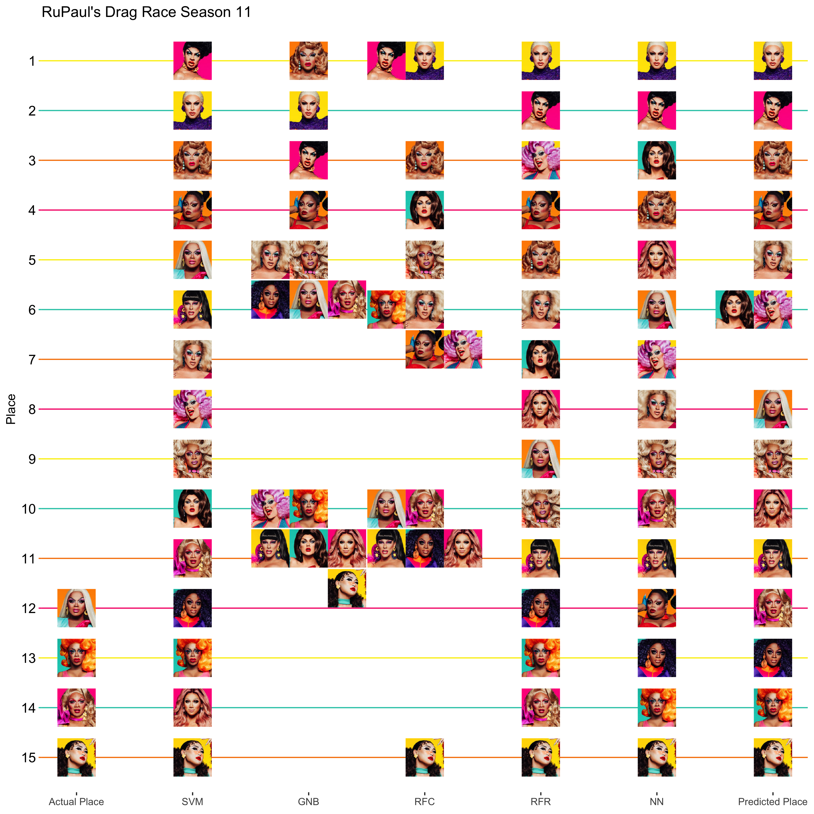

Drag Race Season 11 Episode 4
================
Thomas Elliott
March 28, 2019

# Episode 4: Why?

[This season](../Episode%2001/drag_race_s11e01.md) I re-introduced my
machine learning algorithms for predicting the outcomes of Season 11 of
RuPaul’s Drag Race.

This week the queens performed in a rusical number. Previous seasons
have done a Kardiashian musical and a pharmaceutical-themed musical.
This season, for some reason, the musical was a mash up of Grease and
the current president. It felt very tone deaf, despite focusing on the
women associated with the administration it was still making light of
something that continues to cause a lot of people a lot of real harm.
Regardless, the top three of the week included Yvie Oddly for her
portrayal of Kelly Anne Conway, Brooke Lynn Hytes for Ivana Trump, and
Silky Nutmeg Ganache for Oprah, with Silky taking the win (she looked
just like Oprah it was impressive). Ra’jah, Mercedes, and Vanjie were in
the bottom, with Miss Vanjie being declared safe from having to lip sync
for her life. Ultimately, Mercedes was asked to sashay away, the optics
of which weren’t great: sending the Muslim queen home during a Trump
challenge? After Mercedes already faced a lot of ignorance from the
other queens about her religion, too. Overall, this was not a fun
episode to watch.

Incorporating this week’s performances into the data, the algorithms
have new predictions for the season:

## Support Vector Machines

``` r
s11.svm<-ksvm(the.model,
              data=pre11,
              kernal="rbfdot")
predict11<-predict(s11.svm,
                   season11)
s11.results<-s11.results %>% 
  mutate(SVM=rank(predict11,ties.method = "min"))
```

## Gaussian Naive Bayes

``` r
s11.gnb<-naiveBayes(the.model,
              data=pre11.factor,
              laplace = 0)
predict11<-predict(s11.gnb,
                   season11)
```

    ## Warning in data.matrix(newdata): NAs introduced by coercion

``` r
s11.results<-s11.results %>% 
  mutate(GNB=rank(predict11,ties.method = "min"))
```

## Random Forest Classifier

``` r
s11.rfc<-randomForest(the.model,
              data=pre11.factor,
              ntree=100)
predict11<-predict(s11.rfc,
                   season11)
s11.results<-s11.results %>% 
  mutate(RFC=rank(predict11,ties.method = "min"))
```

## Random Forest Regressor

``` r
s11.rfr<-randomForest(the.model,
              data=pre11,
              ntree=100)
predict11<-predict(s11.rfr,
                   season11)
s11.results<-s11.results %>% 
  mutate(RFR=rank(predict11,ties.method = "min"))
```

## Neural Networks

``` r
s11.nn<-neuralnet(the.model,
              data=pre11,
              hidden=3,
              act.fct = "logistic",
              algorithm = "rprop+")
predict11<-predict(s11.nn,
                   season11)
s11.results<-s11.results %>% 
  mutate(NN=rank(predict11,ties.method = "min"))
```

## Final Predictions

The final predicted score is based on the average of predicted places
for each algorithm.

Brooke Lynn and Yvie continue to claim the top two spots for the season.
Ariel and Mercedes both slip, though, with Miss Vanjie and Silky taking
their spots in the top four. Ra’jah is still predicted to go home next,
since this was her second time lip sycning. If she lands in the bottom
again, chances are she’s heading home.

``` r
s11.results<-s11.results %>% 
  mutate(Average=(SVM+GNB+RFC+RFR+NN)/5,
         `Predicted Rank`=rank(Average, ties.method = "min"))
s11.results %>% 
  arrange(Average) %>% 
  select(-filename) %>% 
  knitr::kable()
```

| Name                     | Place | SVM | GNB | RFC | RFR | NN | Average | Predicted Rank |
| :----------------------- | ----: | --: | --: | --: | --: | -: | ------: | -------------: |
| Brooke Lynn Hytes        |    NA |   2 |   2 |   1 |   1 |  1 |     1.4 |              1 |
| Yvie Oddly               |    NA |   1 |   3 |   1 |   2 |  2 |     1.8 |              2 |
| Vanessa Vanjie Mateo     |    NA |   3 |   1 |   3 |   5 |  4 |     3.2 |              3 |
| Silky Nutmeg Ganache     |    NA |   4 |   4 |   6 |   4 | 12 |     6.0 |              4 |
| Ariel Versace            |    NA |   7 |   5 |   6 |   6 |  8 |     6.4 |              5 |
| Nina West                |    NA |   8 |  10 |   6 |   3 |  7 |     6.8 |              6 |
| Scarlet Envy             |    NA |  10 |  10 |   4 |   7 |  3 |     6.8 |              6 |
| Mercedes Iman Diamond    |    12 |   5 |   5 |  10 |   9 |  6 |     7.0 |              8 |
| A’keria Chanel Davenport |    NA |   9 |   5 |   5 |  10 |  9 |     7.6 |              9 |
| Plastique Tiara          |    NA |  14 |  10 |  10 |   8 |  5 |     9.4 |             10 |
| Shuga Cain               |    NA |   6 |  10 |  10 |  11 | 11 |     9.6 |             11 |
| Kahanna Montrese         |    14 |  11 |   5 |  10 |  14 | 10 |    10.0 |             12 |
| Ra’jah O’Hara            |    NA |  12 |   5 |  10 |  12 | 13 |    10.4 |             13 |
| Honey Davenport          |    13 |  13 |  10 |   6 |  13 | 14 |    11.2 |             14 |
| Soju                     |    15 |  15 |  10 |  15 |  15 | 15 |    14.0 |             15 |

``` r
s11.score<-compareRanks(s11.results$Place, s11.results[["Predicted Rank"]])
```

Rank Score: -1.1

``` r
df<-s11.results %>% 
  mutate(filename=paste0("../queens/",filename,".jpg")) %>% 
  gather(model,rank,Place:`Predicted Rank`) %>% 
  filter(model!="Average") %>% 
  mutate(model=factor(model, levels = c("Place", "SVM", "GNB", "RFC", "RFR", "NN", "Predicted Rank")),
         x=as.numeric(model),
         y=16-rank)
labels<-df %>% 
  filter(model=="Predicted Rank") %>% 
  mutate(x=8)
for(i in unique(df$model) ) {
  places<-list()
  for( n in unique(df$Name) ) {
    temp<-df %>% filter(Name==n&model==i)
    this.rank<-as.character(temp$rank)
    if( !is.na(this.rank) ) {
      if( this.rank %in% names(places) ) {
        places[[this.rank]]<-places[[this.rank]]+1
      } else {
        places[[this.rank]]<-1
      }
      new.xy<-setXY(temp$x,temp$y,places[[this.rank]])
      df$x[df$Name==n&df$model==i]<-new.xy[1]
      df$y[df$Name==n&df$model==i]<-new.xy[2]
    }
  }
}
df %>% 
  ggplot(aes(x=x, y=y)) +
  geom_image(aes(image=filename)) +
  theme_bw() +
  theme(panel.grid.major.x = element_blank(),
        panel.grid.minor = element_blank(),
        panel.border = element_blank(),
        panel.grid.major.y = element_line(color=season.colors),
        axis.text.y = element_text(color="black", size=12),
        axis.ticks.y = element_line(color=season.colors)) +
  scale_x_continuous(name=NULL, breaks=c(1:7), 
                     labels=c("Actual Place", "SVM", "GNB", "RFC", "RFR", "NN", "Predicted Place")) +
  scale_y_continuous(name="Place", breaks=c(1:15), labels=c(15:1)) +
  labs(title="RuPaul's Drag Race Season 11")
```



``` r
ggsave("season11_results.png", width=10, height=10, dpi=400)
```
