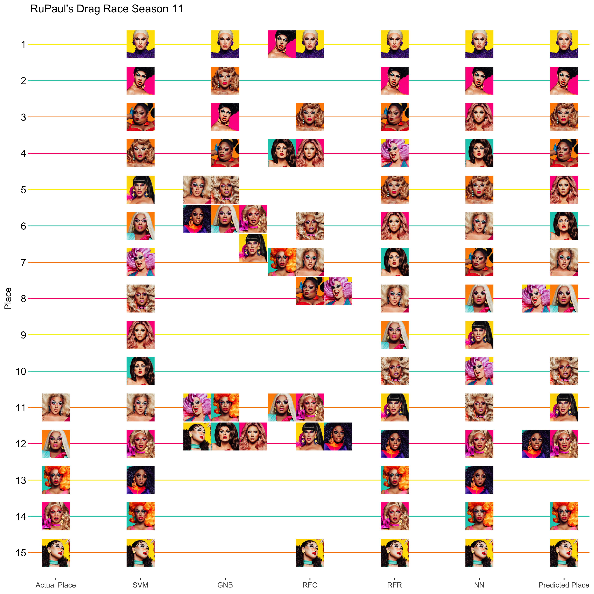

Drag Race Season 11 Episode 5
================
Thomas Elliott
April 4, 2019

# Episode 5: Monster Ball

[This season](../Episode%2001/drag_race_s11e01.md) I re-introduced my
machine learning algorithms for predicting the outcomes of Season 11 of
RuPaul’s Drag Race.

This week established the trend started last season of holding a ball
earlier in the season. Previous to season 10, balls were usually held
when there were five or four queens left. This season, the ball was held
when there were 11 queens left. The theme was Monster Ball, with the
queens having to serve three looks, the last of which they had to make
themselves in the workroom. The first look was Trampy Trick-or-treater,
the second look Witch Please, and the third look MILF: Monsters I’d Like
to Freak. This meant 33 total runway looks this week. Overall, I found
the ball not too exciting. One of the drawbacks of having the ball
earlier is you still have a lot of queens who aren’t quite ready to
fully compete, and so you get a lot of looks that aren’t fully baked.
Those were the majority in this episode, with a few stand-outs. Brooke
Lynn won the challenge with a mummy trick-or-treater coming down the
runway on point (she used to be a professional ballerina), and a very
good Witch Doctor look. Her final look was disappointing, though. This
was Yvie’s challenge to win, and she fell short because of her last
look. Her first two, though, were amazing - a T-Rex for her
trick-or-treater look and a truly inspired witch look. For her final
look, she went for a voodoo doll, but didn’t quite nail it. Nina West
had great looks for all three themes, but bizarrely she was declared
merely safe. Her trick-or-treater was an homage to Little Shop of
Horrors, and she brought a unique twist to her witch look as a Salem
woman with flames around the hem of her dress. Her final look was truly
grotesque.

In the bottom three were Shuga Cain, for shoddy first and third looks,
Ariel Versace for a third look with no monster element, and Silky for
disappointing looks all around. Shuga and Ariel have to lip-sync and
Ariel sashays away.

Incorporating this week’s performances into the data, the algorithms
have new predictions for the season:

## Support Vector Machines

``` r
s11.svm<-ksvm(the.model,
              data=pre11,
              kernal="rbfdot")
predict11<-predict(s11.svm,
                   season11)
s11.results<-s11.results %>% 
  mutate(SVM=rank(predict11,ties.method = "min"))
```

## Gaussian Naive Bayes

``` r
s11.gnb<-naiveBayes(the.model,
              data=pre11.factor,
              laplace = 0)
predict11<-predict(s11.gnb,
                   season11)
```

    ## Warning in data.matrix(newdata): NAs introduced by coercion

``` r
s11.results<-s11.results %>% 
  mutate(GNB=rank(predict11,ties.method = "min"))
```

## Random Forest Classifier

``` r
s11.rfc<-randomForest(the.model,
              data=pre11.factor,
              ntree=100)
predict11<-predict(s11.rfc,
                   season11)
s11.results<-s11.results %>% 
  mutate(RFC=rank(predict11,ties.method = "min"))
```

## Random Forest Regressor

``` r
s11.rfr<-randomForest(the.model,
              data=pre11,
              ntree=100)
predict11<-predict(s11.rfr,
                   season11)
s11.results<-s11.results %>% 
  mutate(RFR=rank(predict11,ties.method = "min"))
```

## Neural Networks

``` r
s11.nn<-neuralnet(the.model,
              data=pre11,
              hidden=3,
              act.fct = "logistic",
              algorithm = "rprop+")
predict11<-predict(s11.nn,
                   season11)
s11.results<-s11.results %>% 
  mutate(NN=rank(predict11,ties.method = "min"))
```

## Final Predictions

The final predicted score is based on the average of predicted places
for each algorithm.

The tops and bottoms haven’t changed since last week (though there has
been some shuffling in the middle). Ra’jah is still predicted to go home
next. Brooke Lynn, Yvie, Vanjie, and Silky continue to hold the top
four.

``` r
s11.results<-s11.results %>% 
  mutate(Average=(SVM+GNB+RFC+RFR+NN)/5,
         `Predicted Rank`=rank(Average, ties.method = "min"))
s11.results %>% 
  arrange(Average) %>% 
  select(-filename) %>% 
  knitr::kable()
```

| Name                     | Place | SVM | GNB | RFC | RFR | NN | Average | Predicted Rank |
| :----------------------- | ----: | --: | --: | --: | --: | -: | ------: | -------------: |
| Brooke Lynn Hytes        |    NA |   1 |   1 |   1 |   1 |  1 |     1.0 |              1 |
| Yvie Oddly               |    NA |   2 |   3 |   1 |   2 |  2 |     2.0 |              2 |
| Vanessa Vanjie Mateo     |    NA |   4 |   2 |   3 |   5 |  5 |     3.8 |              3 |
| Silky Nutmeg Ganache     |    NA |   3 |   4 |   7 |   3 |  7 |     4.8 |              4 |
| Plastique Tiara          |    NA |   9 |  11 |   4 |   6 |  3 |     6.6 |              5 |
| Scarlet Envy             |    NA |  10 |  11 |   4 |   7 |  4 |     7.2 |              6 |
| Ariel Versace            |    11 |  11 |   5 |   7 |   8 |  6 |     7.4 |              7 |
| Mercedes Iman Diamond    |    12 |   6 |   5 |  11 |   9 |  8 |     7.8 |              8 |
| Nina West                |    NA |   7 |  11 |   7 |   4 | 10 |     7.8 |              8 |
| A’keria Chanel Davenport |    NA |   8 |   5 |   6 |  10 | 11 |     8.0 |             10 |
| Shuga Cain               |    NA |   5 |   5 |  11 |  11 |  9 |     8.2 |             11 |
| Kahanna Montrese         |    14 |  12 |   5 |  11 |  14 | 12 |    10.8 |             12 |
| Ra’jah O’Hara            |    NA |  13 |   5 |  11 |  12 | 13 |    10.8 |             12 |
| Honey Davenport          |    13 |  14 |  11 |   7 |  13 | 14 |    11.8 |             14 |
| Soju                     |    15 |  15 |  11 |  15 |  15 | 15 |    14.2 |             15 |

``` r
s11.score<-compareRanks(s11.results$Place, s11.results[["Predicted Rank"]])
```

Rank Score: -0.85

``` r
df<-s11.results %>% 
  mutate(filename=paste0("../queens/",filename,".jpg")) %>% 
  gather(model,rank,Place:`Predicted Rank`) %>% 
  filter(model!="Average") %>% 
  mutate(model=factor(model, levels = c("Place", "SVM", "GNB", "RFC", "RFR", "NN", "Predicted Rank")),
         x=as.numeric(model),
         y=16-rank)
labels<-df %>% 
  filter(model=="Predicted Rank") %>% 
  mutate(x=8)
for(i in unique(df$model) ) {
  places<-list()
  for( n in unique(df$Name) ) {
    temp<-df %>% filter(Name==n&model==i)
    this.rank<-as.character(temp$rank)
    if( !is.na(this.rank) ) {
      if( this.rank %in% names(places) ) {
        places[[this.rank]]<-places[[this.rank]]+1
      } else {
        places[[this.rank]]<-1
      }
      new.xy<-setXY(temp$x,temp$y,places[[this.rank]])
      df$x[df$Name==n&df$model==i]<-new.xy[1]
      df$y[df$Name==n&df$model==i]<-new.xy[2]
    }
  }
}
df %>% 
  ggplot(aes(x=x, y=y)) +
  geom_image(aes(image=filename)) +
  theme_bw() +
  theme(panel.grid.major.x = element_blank(),
        panel.grid.minor = element_blank(),
        panel.border = element_blank(),
        panel.grid.major.y = element_line(color=season.colors),
        axis.text.y = element_text(color="black", size=12),
        axis.ticks.y = element_line(color=season.colors)) +
  scale_x_continuous(name=NULL, breaks=c(1:7), 
                     labels=c("Actual Place", "SVM", "GNB", "RFC", "RFR", "NN", "Predicted Place")) +
  scale_y_continuous(name="Place", breaks=c(1:15), labels=c(15:1)) +
  labs(title="RuPaul's Drag Race Season 11")
```



``` r
ggsave("season11_results.png", width=10, height=10, dpi=400)
```
