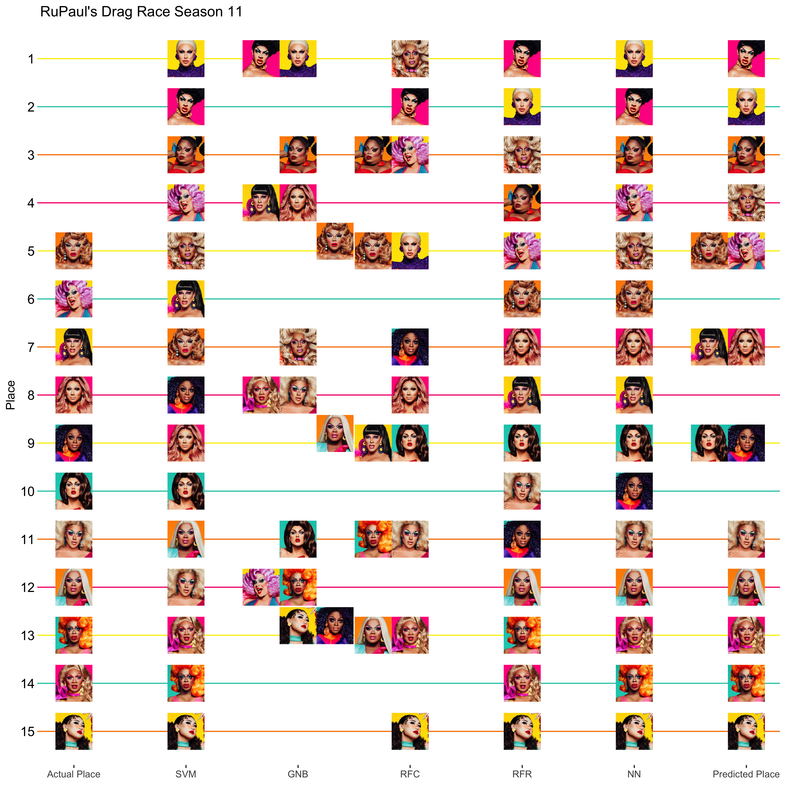

Drag Race Season 11 Episode 6
================
Thomas Elliott
May 30, 2019

# Episode 6: Drag Olympics

[This season](../Episode%2001/drag_race_s11e01.md) I re-introduced my
machine learning algorithms for predicting the outcomes of Season 11 of
RuPaul’s Drag Race.

Incorporating this week’s performances into the data, the algorithms
have new predictions for the season:

## Support Vector Machines

``` r
s11.svm<-ksvm(the.model,
              data=pre11,
              kernal="rbfdot")
predict11<-predict(s11.svm,
                   season11)
s11.results<-s11.results %>% 
  mutate(SVM=rank(predict11,ties.method = "min"))
```

## Gaussian Naive Bayes

``` r
s11.gnb<-naiveBayes(the.model,
              data=pre11.factor,
              laplace = 0)
predict11<-predict(s11.gnb,
                   season11)
```

    ## Warning in data.matrix(newdata): NAs introduced by coercion

``` r
s11.results<-s11.results %>% 
  mutate(GNB=rank(predict11,ties.method = "min"))
```

## Random Forest Classifier

``` r
s11.rfc<-randomForest(the.model,
              data=pre11.factor,
              ntree=100)
predict11<-predict(s11.rfc,
                   season11)
s11.results<-s11.results %>% 
  mutate(RFC=rank(predict11,ties.method = "min"))
```

## Random Forest Regressor

``` r
s11.rfr<-randomForest(the.model,
              data=pre11,
              ntree=100)
predict11<-predict(s11.rfr,
                   season11)
s11.results<-s11.results %>% 
  mutate(RFR=rank(predict11,ties.method = "min"))
```

## Neural Networks

``` r
s11.nn<-neuralnet(the.model,
              data=pre11,
              hidden=3,
              act.fct = "logistic",
              algorithm = "rprop+")
predict11<-predict(s11.nn,
                   season11)
s11.results<-s11.results %>% 
  mutate(NN=rank(predict11,ties.method = "min"))
```

## Final Predictions

The final predicted score is based on the average of predicted places
for each algorithm.

``` r
s11.results<-s11.results %>% 
  mutate(Average=(SVM+GNB+RFC+RFR+NN)/5,
         `Predicted Rank`=rank(Average, ties.method = "min"))
s11.results %>% 
  arrange(Average) %>% 
  select(-filename) %>% 
  knitr::kable()
```

| Name                     | Place | SVM | GNB | RFC | RFR | NN | Average | Predicted Rank |
| :----------------------- | ----: | --: | --: | --: | --: | -: | ------: | -------------: |
| Yvie Oddly               |    NA |   2 |   1 |   2 |   1 |  2 |     1.6 |              1 |
| Brooke Lynn Hytes        |    NA |   1 |   1 |   5 |   2 |  1 |     2.0 |              2 |
| Silky Nutmeg Ganache     |    NA |   3 |   3 |   3 |   4 |  3 |     3.2 |              3 |
| A’keria Chanel Davenport |    NA |   5 |   7 |   1 |   3 |  5 |     4.2 |              4 |
| Nina West                |     6 |   4 |  12 |   3 |   5 |  4 |     5.6 |              5 |
| Vanessa Vanjie Mateo     |     5 |   7 |   4 |   5 |   6 |  6 |     5.6 |              5 |
| Plastique Tiara          |     8 |   9 |   4 |   8 |   7 |  7 |     7.0 |              7 |
| Shuga Cain               |     7 |   6 |   4 |   9 |   8 |  8 |     7.0 |              7 |
| Ra’jah O’Hara            |     9 |   8 |  12 |   7 |  11 | 10 |     9.6 |              9 |
| Scarlet Envy             |    10 |  10 |  11 |   9 |   9 |  9 |     9.6 |              9 |
| Ariel Versace            |    11 |  12 |   8 |  11 |  10 | 11 |    10.4 |             11 |
| Mercedes Iman Diamond    |    12 |  11 |   8 |  13 |  12 | 12 |    11.2 |             12 |
| Kahanna Montrese         |    14 |  13 |   8 |  13 |  14 | 13 |    12.2 |             13 |
| Honey Davenport          |    13 |  14 |  12 |  11 |  13 | 14 |    12.8 |             14 |
| Soju                     |    15 |  15 |  12 |  15 |  15 | 15 |    14.4 |             15 |

``` r
s11.score<-compareRanks(s11.results$Place, s11.results[["Predicted Rank"]])
```

Rank Score: 0.977

``` r
df<-s11.results %>% 
  mutate(filename=paste0("../queens/",filename,".jpg")) %>% 
  gather(model,rank,Place:`Predicted Rank`) %>% 
  filter(model!="Average") %>% 
  mutate(model=factor(model, levels = c("Place", "SVM", "GNB", "RFC", "RFR", "NN", "Predicted Rank")),
         x=as.numeric(model),
         y=16-rank)
labels<-df %>% 
  filter(model=="Predicted Rank") %>% 
  mutate(x=8)
for(i in unique(df$model) ) {
  places<-list()
  for( n in unique(df$Name) ) {
    temp<-df %>% filter(Name==n&model==i)
    this.rank<-as.character(temp$rank)
    if( !is.na(this.rank) ) {
      if( this.rank %in% names(places) ) {
        places[[this.rank]]<-places[[this.rank]]+1
      } else {
        places[[this.rank]]<-1
      }
      new.xy<-setXY(temp$x,temp$y,places[[this.rank]])
      df$x[df$Name==n&df$model==i]<-new.xy[1]
      df$y[df$Name==n&df$model==i]<-new.xy[2]
    }
  }
}
df %>% 
  ggplot(aes(x=x, y=y)) +
  geom_image(aes(image=filename)) +
  theme_bw() +
  theme(panel.grid.major.x = element_blank(),
        panel.grid.minor = element_blank(),
        panel.border = element_blank(),
        panel.grid.major.y = element_line(color=season.colors),
        axis.text.y = element_text(color="black", size=12),
        axis.ticks.y = element_line(color=season.colors)) +
  scale_x_continuous(name=NULL, breaks=c(1:7), 
                     labels=c("Actual Place", "SVM", "GNB", "RFC", "RFR", "NN", "Predicted Place")) +
  scale_y_continuous(name="Place", breaks=c(1:15), labels=c(15:1)) +
  labs(title="RuPaul's Drag Race Season 11")
```



``` r
ggsave("season11_results.png", width=10, height=10, dpi=400)
```
